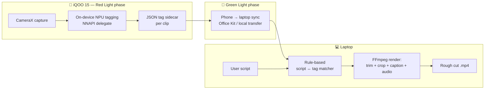

# ClipForge

**An NPU-native rough-cut engine.** Shoot clips → the phone tags them on-device →
sync to a laptop → a script gets matched to the best-tagged clips and rendered
into a rough cut. No cloud calls anywhere in the pipeline.

Built for the **iQOO Hackathon 2026** (Hyderabad City Battle) — Team Kaizen,
track: Productivity.

**[Live demo →](https://sivakalki.github.io/ClipForge/)**

---

## The idea

Editing raw phone footage into a postable rough cut is the single biggest
time sink in short-form content creation. ClipForge shrinks that from
"open an editing app and manually scrub through footage" to: the phone
tags what's *in* each clip as it's shot, and a script alone is enough to
generate a matched, ordered, captioned rough cut.

## What's real vs. simulated in this build

Being upfront about scope, since this matters more than a polished pitch:

| Piece | Status |
| --- | --- |
| Rule-based script-to-clip matcher | **Real** — [demo/matcher.py](demo/matcher.py), keyword/tag overlap scoring |
| FFmpeg trim/crop/caption/audio render pipeline | **Real** — [demo/render.py](demo/render.py) |
| Tag sidecar schema | **Real**, matches the schema below exactly |
| On-device NPU tagging (phone) | **Simulated** — we don't have access to an NPU-equipped iQOO device for this build, so tags in `demo/tags/*.json` are hand-labeled to prove the schema and downstream pipeline. The [tech stack](#tech-stack) below is what a real implementation would use. |
| Phone capture app | **Not built** — see above; this repo's `demo/` is the laptop-side half of the pipeline, exercised against sample footage |
| Office Kit sync | **Simulated** in the demo UI's narration — the actual transfer mechanism is a swappable interface (see tech stack), not yet wired to the real Office Kit SDK |

The demo is intentionally laptop-only so the actual matching + rendering logic
— the part we could fully build and verify — is real and testable, rather than
mocking the whole thing end-to-end.

## Architecture



## Tech stack

| Layer | Tool | Notes |
| --- | --- | --- |
| Capture | CameraX (Kotlin, Android) | Custom capture screen, not the stock camera app |
| On-device tagging | YOLOv8-Nano or MobileNetV3, `.tflite` / ONNX Mobile | Pre-trained + quantized |
| NPU acceleration | Android NNAPI delegate | Runs on the NPU, not CPU/GPU fallback |
| Local tag storage | Plain JSON sidecar per clip | Schema below |
| Phone → laptop sync | Local file transfer (Office Kit at the event) | Kept swappable — not hardcoded into core logic |
| Laptop app | Python 3.11+ | |
| Script-to-clip matching | Rule-based tag/keyword matcher | Embedding-based matcher is a stretch goal, not required |
| Video assembly | FFmpeg via subprocess | |

## Tag sidecar schema

```json
{
  "clip_id": "string",
  "file": "relative/path/to/clip.mp4",
  "duration_s": 3.2,
  "tags": [
    { "t_start": 0.0, "t_end": 1.5, "label": "Product Close-up", "confidence": 0.92 },
    { "t_start": 1.5, "t_end": 3.2, "label": "Bright Lighting", "confidence": 0.88 }
  ],
  "created_at": "ISO-8601 timestamp"
}
```

This is the contract between the phone-side tagger and the laptop-side matcher.

## Repo layout

```
/demo            # the buildable half of this submission — see demo/README.md
  clips_raw/       # original uploaded footage
  clips/           # trimmed/cropped/sped-up clips the pipeline actually uses
  tags/            # NPU tag sidecars (hand-labeled for this demo)
  matcher.py       # script beat -> clip matching
  render.py        # ffmpeg trim/crop/caption/audio render
  webapp/          # local + static (GitHub Pages) demo UI
/assets           # shared audio track
CLAUDE.md         # full project/build spec
demo_build_steps.md
```

## Running it

```bash
make demo   # tags clips + renders the rough cut, see demo/README.md for details
```

Or use the web UI: `python3 demo/webapp/server.py`, or the fully static build
already deployed at the live demo link above.

## Team

Team Kaizen — iQOO Hackathon 2026, Hyderabad City Battle, Productivity track.
